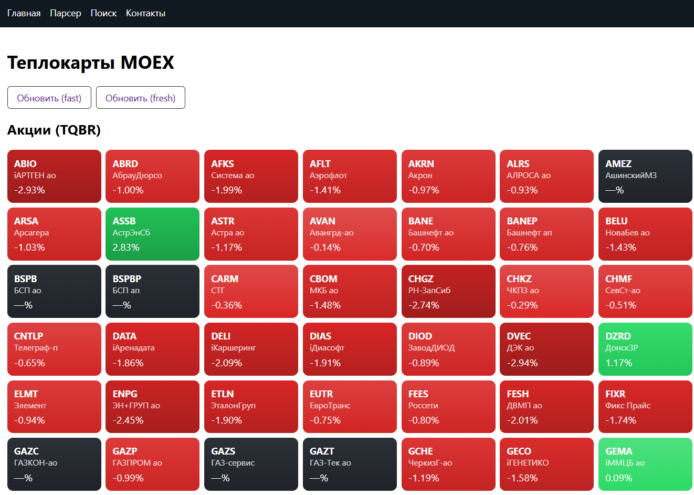

<div align="center">

# 📊 FlaskParserMOEX

### Веб-платформа для анализа данных Московской биржи (MOEX)



[]()
[]()
[]()
[](LICENSE)
[]()
[]()

</div>

Современный веб-сервис на **Flask**, который отображает теплокарты Московской биржи (MOEX) по акциям (TQBR) и фьючерсам (RFUD).  
Проект вдохновлён [parserMOEX](https://github.com/ipARTEM/parserMOEX), но полностью переработан:  
— добавлен **Flask**, **Blueprints**, **кэширование**, динамические страницы и API.  
— плитки подсвечиваются градиентом: от 🟥 красного (сильное падение) до 🟩 зелёного (сильный рост).  

---

## 🚀 Возможности

| Функция | Описание |
|----------|-----------|
| 🏠 **Главная** | Приветственная страница проекта |
| 📈 **Теплокарты** | Отображение акций (TQBR) и фьючерсов (RFUD) с динамическими цветами |
| 🔍 **Поиск** | Поиск по тикеру и названию бумаги |
| 💾 **Снимки БД** | Сохранение исторических данных в SQLite |
| 🧩 **REST-API** | JSON-интерфейс для получения данных |
| 🎨 **Градиент плиток** | Цвет от 🟥 (падение) до 🟩 (рост) отражает процент изменения цены |

---

> [!TIP]
> Проект реализует **чистую архитектуру Flask** с использованием **Blueprint-ов**,  
> модульного разделения логики (MVC), ORM-моделей и сервисного слоя (`repository` и `services`).

---

## 🧩 Структура данных (ORM SQLAlchemy)

| Модель | Назначение | Связи |
|--------|-------------|--------|
| **Engine** | Движок торгов (`stock`, `futures`) | 1 → N Market |
| **Market** | Рынок (`shares`, `forts`) | 1 → N Board |
| **Board** | Биржевая доска (`TQBR`, `RFUD`) | 1 → N Snapshot |
| **Security** | Бумага (`GAZP`, `SBER`, `LKOH`) | 1 → N SnapshotItem |
| **Snapshot** | Снимок состояния доски во времени | 1 → N SnapshotItem |
| **SnapshotItem** | Отдельная строка снимка | — |

Все связи реализованы через `relationship()`,  
а работа с данными полностью объектная, без ручных SQL-запросов.

---

## 🖼️ Скриншот


---

## ⚙️ Установка и запуск (Windows)
```bash
# 1. Клонирование проекта
git clone https://github.com/ipARTEM/FlaskParserMOEX.git
cd FlaskParserMOEX

# 2. Виртуальное окружение
python -m venv .venv
.\.venv\Scripts\activate

# 3. Установка зависимостей
pip install -r requirements.txt

# 4. Создание базы данных
python -m scripts.create_db

# 5. Загрузка реальных данных с MOEX
python -m scripts.seed_from_moex

# 6. Проверка выборки
python -m scripts.show_latest

# 7. Запуск веб-сервера
$env:FLASK_ADMIN_TOKEN="set-your-strong-admin-token"
python run.py

--- 
REST-API

# Получить теплокарты акций и фьючерсов
GET /market/api/heatmap

# Поиск по тикеру или названию
GET /market/api/search?q=SBER

# Получить снимок за конкретную дату
GET /market/api/snapshot?board=TQBR&at=2025-10-06

Ответ:

{
  "TQBR": [
    {"secid": "SBER", "name": "Сбербанк", "last": 276.4, "change": 0.8, "valtoday": 123456789},
    {"secid": "GAZP", "name": "Газпром", "last": 156.2, "change": -0.3, "valtoday": 987654321}
  ]
}


👨‍💻 Автор  Artem Khimin

📝 Лицензия

Этот проект распространяется под лицензией MIT License.
© 2025 Artem Khimin