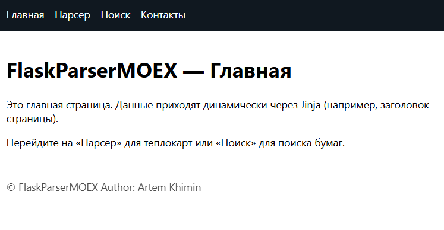
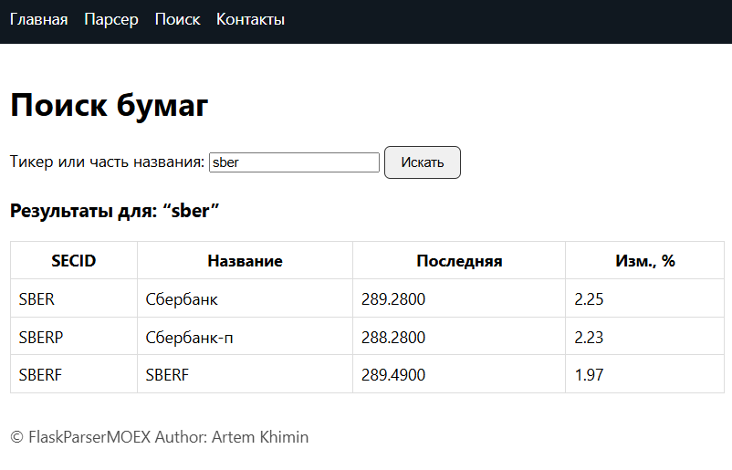
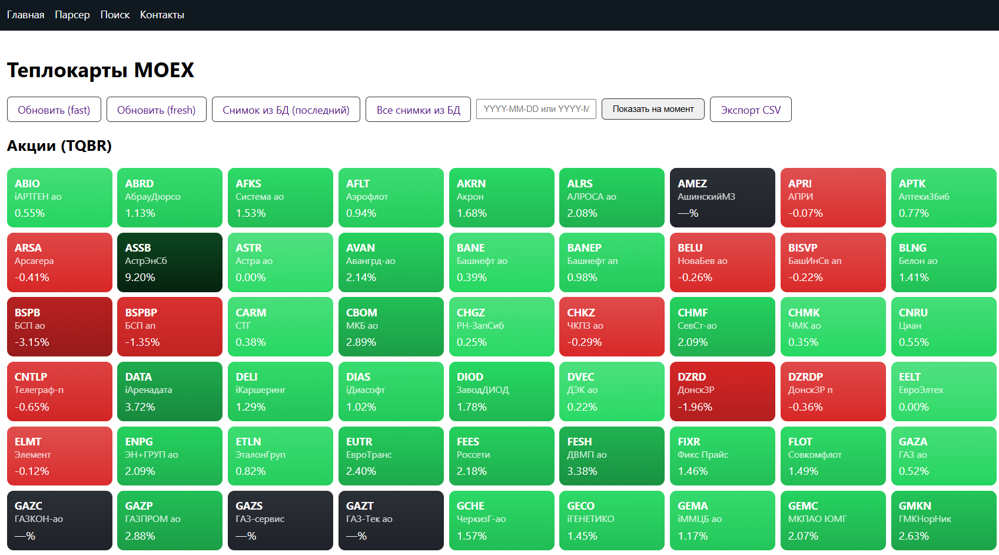
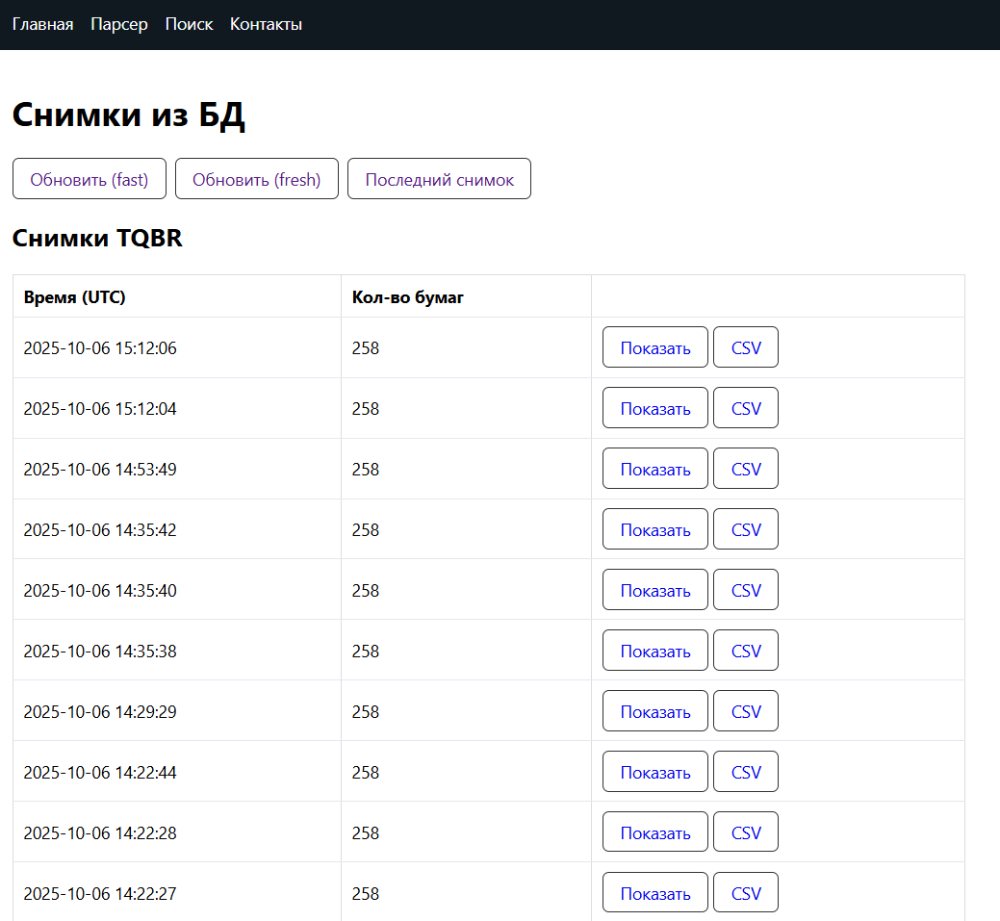
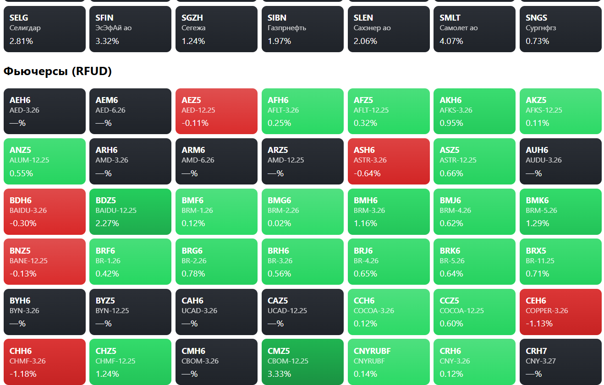

# 📊 FlaskParserMOEX

Современный веб-сервис на **Flask**, который отображает теплокарты Московской биржи (MOEX) по акциям (TQBR) и фьючерсам (RFUD).  
Проект вдохновлён [parserMOEX](https://github.com/ipARTEM/parserMOEX), но полностью переработан:  
— добавлен **Flask**, **Blueprints**, **кэширование**, динамические страницы и API.  
— плитки подсвечиваются градиентом: от 🟥 красного (сильное падение) до 🟩 зелёного (сильный рост).  

---

## 🚀 Возможности

- **Главная страница** – приветственный экран.
- **Контакты** – данные об авторе (динамически подставляются).
- **Теплокарты** – визуализация бумаг с процентным изменением.
- **Поиск** – форма для поиска тикеров и названий.
- **API** – доступ к теплокартам и поиску в JSON:
  - `/market/api/heatmap`
  - `/market/api/search?q=GAZP`

---

## 🖼️ Скриншот







---

## ⚙️ Установка и запуск (Windows)

```powershell
git clone https://github.com/ipARTEM/FlaskParserMOEX.git
cd FlaskParserMOEX

# Создаём виртуальное окружение
py -3 -m venv .venv
.\.venv\Scripts\activate

# Устанавливаем зависимости
pip install -r requirements.txt

# (опционально) задаём токен для админ-обновления
$env:FLASK_ADMIN_TOKEN="set-your-strong-admin-token"

# Запуск
python run.py


### История и экспорт
- `/market/snapshot` — показывает последний снимок из SQLite.
- `/market/snapshot?at=YYYY-MM-DD[ HH:MM]` — снимок «на момент времени» (UTC).
- `/market/api/snapshot?board=TQBR&at=...` — JSON-API (одна/обе доски).
- `/market/snapshot.csv?at=...` — экспорт снимка в CSV.

